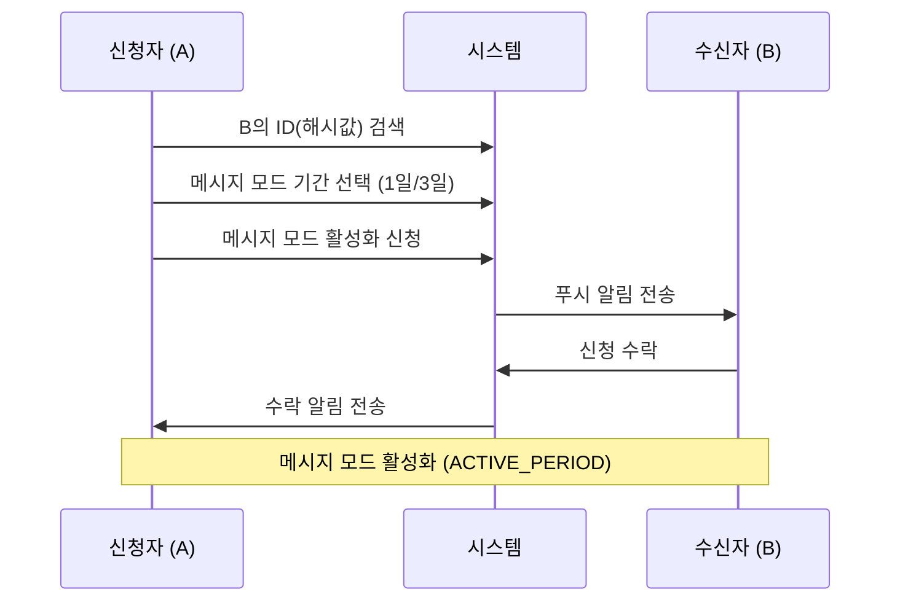

# 메시지 모드 시스템

## 개념 정의

메시지 모드는 매일 신청·수락을 반복하는 구조가 아니라, **일정 기간 동안 메시지를 보낼 수 있는 권한**을 의미한다.

---

## 메시지 모드 활성화 흐름



### 상세 단계

1. A가 B의 ID(해시값)를 검색
2. A가 메시지 모드 기간 선택
   - 1일 (500원)
   - 3일 (1,000원)
3. A가 B에게 메시지 모드 활성화 신청
4. B가 수락
5. 메시지 모드 활성화 (`ACTIVE_PERIOD`)

> **Note**: 메시지 모드 활성화는 **최초 1회만** 이루어진다.

---

## 메시지 모드 활성화 중 규칙

| 항목 | 규칙 |
|------|------|
| 메시지 전송 | 하루 최대 1개 |
| 전송 의무 | 매일 보낼 필요 없음 (선택) |
| 전송 권한 | 신청자(A)만 전송 가능 |
| 수신 권한 | 수신자(B)는 메시지 수신만 가능 |
| 결제 | 메시지 전송 시 단건 결제 필요 |
| 양방향 발신 | B가 A에게 보내려면 새로운 메시지 모드 요청 필요 |

### B가 A에게 메시지를 보내고 싶을 때

B 화면에 표시할 문구:
- ❌ 잘못된 표현: "A에게 메시지 보내기 (신청)"
- ✅ 좋은 표현: "내 마음도 전할래요" / "이번엔 내가 보내고 싶어요"

버튼 클릭 시 내부 로직: `B → A 신청` (기존 신청 로직과 동일)

---

## 메시지 모드 종료

### 자동 종료 조건
- 선택한 기간(1일 / 3일) 종료 시
- 상태가 `EXPIRED`로 변경됨

### 종료 후 행동
- 다시 메시지를 보내려면 새로운 메시지 모드 활성화 신청 필요

---

## 사용자 제한 규칙

| 제한 항목 | 설명 |
|----------|------|
| 동시 연결 | 한 유저는 동시에 **하나의 메시지 모드만** 활성화 가능 |
| 일일 발신 | 최대 1개 메시지 발신 가능 |
| 일일 수신 | 최대 1개 메시지 수신 가능 |

---

## 코드 구현 (Server)

### MessageMode 모델

위치: `packages/server/src/models/MessageMode.ts`

```typescript
interface IMessageMode {
    initiator: ObjectId;     // 신청한 유저 (결제한 유저)
    recipient: ObjectId;     // 받는 유저
    status: MessageModeStatus;
    startDate?: Date;        // 수락하여 활성화된 시점
    endDate?: Date;          // 활성화 시점 + durationDays
    durationDays: 1 | 3;     // 1일권 or 3일권
    requestedAt?: Date;      // PENDING 신청 시점
    expiresAt?: Date;        // PENDING 만료 시점 (requestedAt + 24h)
    reminderSent?: boolean;  // 리마인드 푸시 전송 여부
    reminderSentAt?: Date;   // 리마인드 푸시 전송 시점
}
```

### 주요 API 엔드포인트

| Method | Endpoint | 설명 | 접근 권한 |
|--------|----------|------|----------|
| POST | `/modes/request` | 메시지 모드 신청 | Private |
| POST | `/modes/accept/:id` | 신청 수락 | Private (recipient only) |
| POST | `/modes/reject/:id` | 신청 거절 | Private (recipient only) |
| POST | `/modes/block/:id` | 신청 차단 | Private (recipient only) |
| GET | `/modes/current` | 현재 모드 상태 조회 | Private |

### hasActiveMode 검증

한 유저가 이미 활성 상태의 모드(`PENDING` 또는 `ACTIVE_PERIOD`)가 있는지 확인하는 유틸:

```typescript
const hasActiveMode = async (userId: string, excludeModeId?: string) => {
    const query = {
        $or: [{ initiator: userId }, { recipient: userId }],
        status: { $in: ['PENDING', 'ACTIVE_PERIOD'] },
    };
    if (excludeModeId) {
        query._id = { $ne: excludeModeId };
    }
    return !!(await MessageMode.findOne(query));
};
```

---

## 코드 구현 (App)

### Connection 타입 정의

위치: `packages/app/src/types/index.ts`

```typescript
interface Connection {
    _id: string;
    status: ConnectionStatus;
    initiator: User | string;
    recipient: User | string;
    durationDays?: 1 | 3;
    startDate?: Date;
    endDate?: Date;
    canSendToday?: boolean;
    remainingDays?: number;
}
```

### API 함수

위치: `packages/app/src/services/api.ts`

- `getCurrentMode()`: 현재 모드 상태 조회
- `requestMode(payload)`: 메시지 모드 신청
- `acceptMode(modeId)`: 신청 수락
- `rejectMode(modeId)`: 신청 거절
- `blockRequest(modeId)`: 신청 차단
