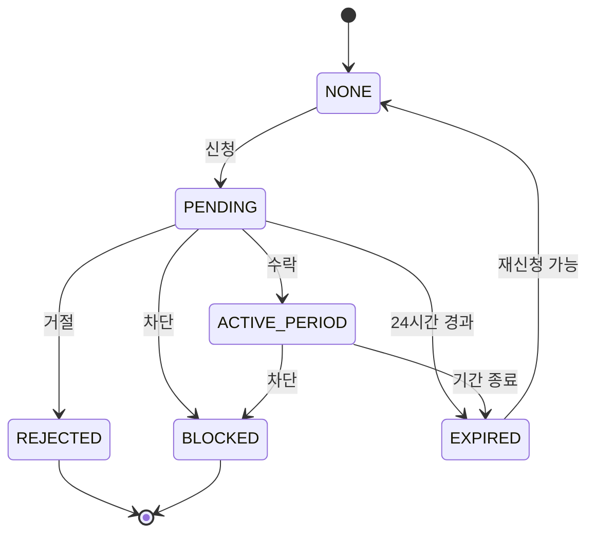

# 연결 상태 정의

## 상태 목록

```typescript
type ConnectionStatus =
    | 'NONE'           // 연결 없음
    | 'PENDING'        // 신청 대기
    | 'ACTIVE_PERIOD'  // 메시지 모드 활성
    | 'EXPIRED'        // 기간 종료
    | 'REJECTED'       // 거절됨
    | 'BLOCKED'        // 차단됨
    | 'CANCELED';      // 취소됨 (서버에만 존재)
```

---

## 상태별 상세 설명

### NONE
- **설명**: 두 사용자 간 활성화된 관계가 없음
- **사용자 액션**: 메시지 모드 신청 가능
- **UI 표시**: 홈에서 "메시지 모드 신청하기" 버튼 표시

### PENDING
- **설명**: 메시지 모드 활성화 신청이 전송된 상태
- **대기 상태**: 수신자의 수락 또는 거절 대기 중
- **만료 조건**: PENDING 신청은 24시간 후 자동 만료
- **서버 필드**: `requestedAt`, `expiresAt`

#### 만료 체크 로직 (Server)
```typescript
// acceptMode 함수 내
if (mode.expiresAt && now > mode.expiresAt) {
    mode.status = 'EXPIRED';
    await mode.save();
    throw new Error('This request has expired');
}
```

### ACTIVE_PERIOD
- **설명**: 메시지 모드가 활성화된 상태
- **기간**: 선택한 기간(1일 / 3일) 동안 유지
- **전송 권한**: 신청자만 메시지 전송 가능
- **일일 제한**: 하루 최대 1회 메시지 전송 가능
- **서버 필드**: `startDate`, `endDate`

#### 남은 일수 계산 (Server)
```typescript
let remainingDays = 0;
if (mode.endDate) {
    const today = getToday();
    const endDate = new Date(mode.endDate);
    const diffTime = Math.max(endDate.getTime() - today.getTime(), 0);
    remainingDays = Math.ceil(diffTime / (1000 * 60 * 60 * 24));
}
```

### EXPIRED
- **설명**: 메시지 모드 기간이 종료된 상태
- **제약**: 메시지 전송 불가
- **사용자 액션**: 재활성화를 위해 다시 신청 필요

### REJECTED
- **설명**: 수신자가 메시지 모드 활성화를 거절한 상태
- **결과**: 해당 신청은 즉시 종료됨
- **알림**: 신청자에게 거절 푸시 알림 전송

### BLOCKED
- **설명**: 한쪽 사용자가 상대를 차단한 상태
- **제약**: 모든 신청 및 메시지 전송 불가
- **처리**: User의 `blockedUsers` 배열에 hashId 추가

### CANCELED (서버 전용)
- **설명**: 모드가 취소된 상태
- **사용 사례**: 결제 취소 등 시스템 처리

---

## 상태 전이 다이어그램



---

## 상태 관련 서버 검증

### 신청 시 검증 (`requestMode`)

1. 대상 유저 존재 확인
2. 차단 여부 확인 (양방향)
3. 자기 자신에게 요청 불가
4. 신청자가 이미 활성 모드 보유 여부
5. 수신자가 이미 활성 모드 보유 여부

### 수락 시 검증 (`acceptMode`)

1. 모드 존재 확인
2. 수신자 본인 여부 확인
3. PENDING 상태 확인
4. PENDING 만료 여부 확인
5. 중복 상태 재확인 (race condition 방지)

---

## UI 상태별 표시

### HomeScreen

| 상태 | 메인 문구 | 액션 |
|------|----------|------|
| NONE | "오늘, 마음을 전할 사람이 있나요?" | 메시지 모드 신청하기 버튼 |
| PENDING (발신자) | "상대의 수락을 기다리고 있어요." | 버튼 없음 |
| PENDING (수신자) | "누군가 마음을 전하고 싶어 해요." | 수락/거절/차단 버튼 |
| ACTIVE_PERIOD | "메시지 모드 진행 중" | 오늘의 메시지 보내기 버튼 |
| EXPIRED | "메시지 모드가 종료되었어요." | 다시 신청하기 버튼 |
