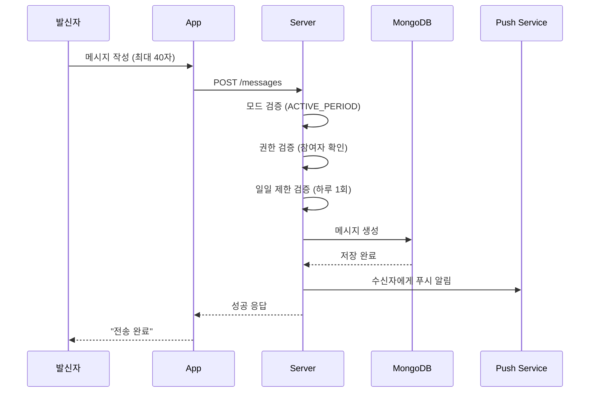

# 메시지 시스템

## 개요

앱하루의 메시지는 단일 메시지 철학을 기반으로, **하루에 한 번만 전송 가능**하며 **24시간 후 자동 만료**된다.

---

## 메시지 모델

위치: `packages/server/src/models/Message.ts`

```typescript
interface IMessage {
    modeId: ObjectId;      // 어떤 모드(연결)에서 보내진 것인지
    sender: ObjectId;      // 보낸 사람
    content: string;       // 메시지 내용 (최대 1000자, 실제 UI는 40자 제한)
    isRead: boolean;       // 읽음 여부
    status: MessageStatus; // 'ACTIVE' | 'EXPIRED'
    sentAt: Date;          // 전송 시점
    expiresAt: Date;       // 만료 시점 (sentAt + 24시간)
    createdAt: Date;       // 생성 시점
}

type MessageStatus = 'ACTIVE' | 'EXPIRED';
```

---

## 메시지 전송 흐름



---

## 메시지 전송 검증

위치: `packages/server/src/controllers/messageController.ts`

### 검증 순서

1. **입력 검증**: `content`와 `modeId` 필수
2. **모드 존재 확인**: MessageMode 조회
3. **권한 검증**: 요청자가 모드 참여자인지 확인
4. **모드 상태 검증**: `ACTIVE_PERIOD` 상태인지 확인
5. **기간 만료 검증**: `endDate`가 지났는지 확인
6. **일일 제한 확인**: 오늘 이미 메시지를 보냈는지 확인

### 일일 제한 검증 코드

```typescript
const startOfDay = getToday();
startOfDay.setHours(0, 0, 0, 0);
const endOfDay = getToday();
endOfDay.setHours(23, 59, 59, 999);

const existMessage = await Message.findOne({
    modeId: mode._id,
    sender: senderId,
    sentAt: {
        $gte: startOfDay,
        $lte: endOfDay,
    },
});

if (existMessage) {
    throw new Error('You have already sent a message today');
}
```

---

## 메시지 만료 처리

### 만료 시점
- 각 메시지는 `expiresAt = sentAt + 24시간`으로 설정됨

### 만료 시스템
- 배치 스케줄러가 주기적으로 만료된 메시지의 status를 `EXPIRED`로 변경
- 위치: `packages/server/src/schedulers/messageCleanupScheduler.ts`

---

## 메시지 API 엔드포인트

| Method | Endpoint | 설명 | 접근 권한 |
|--------|----------|------|----------|
| POST | `/messages` | 메시지 전송 | Private |
| GET | `/messages/received/today` | 오늘 받은 활성 메시지 조회 | Private |
| POST | `/messages/:id/read` | 메시지 읽음 표시 | Private (수신자만) |

---

## 메시지 조회

### 오늘 받은 메시지 조회 (`getTodayMessage`)

1. 현재 활성 모드 찾기 (`ACTIVE_PERIOD`)
2. 상대방(sender) ID 확인
3. `ACTIVE` 상태이고 만료되지 않은 메시지 중 가장 최근 것 조회

```typescript
const message = await Message.findOne({
    modeId: activeMode._id,
    sender: partnerId,
    status: 'ACTIVE',
    expiresAt: { $gt: now },
})
    .populate('sender', 'hashId nickname')
    .sort({ sentAt: -1 });
```

---

## 메시지 읽음 처리

### 읽음 표시 조건
1. 메시지 존재 확인
2. 해당 메시지의 모드 확인
3. 요청자가 수신자인지 확인 (발신자는 읽음 처리 불가)
4. 이미 읽은 경우 중복 처리 방지

---

## UI 메시지 입력 규칙

### 글자 수 제한
- **UI 제한**: 40자
- **DB 제한**: 1000자 (안전 마진)

### UX 문구

```
입력창 상단:
"한 문장이면 충분해요.
오늘의 마음만 전해도요."

입력창 하단:
"이 메시지는 하루에 한 번만 보낼 수 있어요."
```

### 철학
- 글자 수보다 **감정을 얼마나 허용해주는지**가 중요
- 입력 제한(40자)을 직접 강조하지 않음
- **짧아도 충분하다는 정서적 안내 문구** 배치

---

## App API 함수

위치: `packages/app/src/services/api.ts`

```typescript
// 메시지 전송
interface SendMessagePayload {
    content: string;
    modeId: string;
}
export const sendMessage = async (payload: SendMessagePayload): Promise<any>

// 오늘 받은 메시지 조회
interface ReceivedMessage {
    _id: string;
    modeId: string;
    sender: { _id: string; hashId: string; nickname?: string } | string;
    content: string;
    isRead: boolean;
    sentAt: string;
    createdAt: string;
}
export const getTodayReceivedMessage = async (): Promise<{ message: ReceivedMessage | null }>

// 메시지 읽음 표시
export const markMessageAsRead = async (messageId: string): Promise<any>
```
