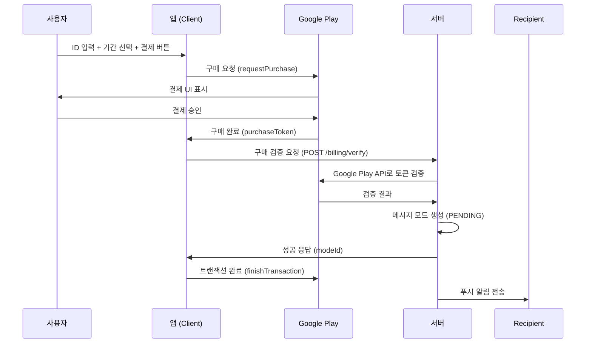

# 결제 모듈 (Billing Module)

## 개요
Google Play Billing을 사용하여 메시지 모드(1일권/3일권) 결제를 처리합니다.

> **참고**: 외부 결제 수단(카카오페이 등)은 Google Play 정책상 앱 내 디지털 상품에 사용할 수 없습니다.

---

## 상품 정보

| 상품 ID | 가격 | 기간 | 설명 |
|---------|------|------|------|
| `message_mode_1day` | 500원 | 1일 | 하루 동안 메시지 전송 가능 |
| `message_mode_3day` | 1,000원 | 3일 | 3일 동안 메시지 전송 가능 |

---

## 결제 흐름



---

## 클라이언트 구현

### 파일 위치
- `packages/app/src/services/billing.ts`

### 주요 함수

```typescript
// IAP 연결 초기화
initBilling(): Promise<boolean>

// IAP 연결 종료
endBilling(): Promise<void>

// 상품 목록 조회
getProducts(): Promise<Product[]>

// 구매 요청
requestPurchase(productId: string): Promise<PurchaseResult>

// 서버에 구매 검증 요청
verifyPurchaseWithServer(
    productId: string,
    purchaseToken: string,
    recipientHashId: string
): Promise<{ success: boolean; modeId?: string; error?: string }>
```

### 상품 ID 상수
```typescript
export const PRODUCT_IDS = {
    MESSAGE_MODE_1DAY: 'message_mode_1day',
    MESSAGE_MODE_3DAY: 'message_mode_3day',
}
```

---

## 서버 API

### POST /billing/verify
구매 토큰을 검증하고 메시지 모드를 생성합니다.

**Request Body:**
```json
{
    "productId": "message_mode_1day",
    "purchaseToken": "string",
    "recipientHashId": "ce9322",
    "durationDays": 1
}
```

**Response (201 Created):**
```json
{
    "success": true,
    "modeId": "ObjectId",
    "status": "PENDING",
    "message": "Purchase verified and mode created"
}
```

**Error Responses:**
| 상태 코드 | 메시지 | 설명 |
|-----------|--------|------|
| 400 | Invalid productId | 잘못된 상품 ID |
| 400 | You already have an active or pending mode | 이미 진행 중인 모드 존재 |
| 400 | The recipient is currently busy | 수신자가 다른 모드 진행 중 |
| 403 | You are blocked by this user | 차단됨 |
| 404 | Recipient not found | 수신자를 찾을 수 없음 |

---

### POST /billing/cancel
결제 취소 시 PENDING 상태의 모드를 취소합니다.

**Request Body:**
```json
{
    "modeId": "ObjectId",
    "reason": "optional cancel reason"
}
```

**Response:**
```json
{
    "success": true,
    "message": "Mode cancelled successfully"
}
```

---

## 환경 설정

### Google Play Console 설정
1. **인앱 상품 등록**
   - Play Console → 앱 선택 → 수익 창출 → 제품 → 인앱 상품
   - `message_mode_1day` (500원) 생성
   - `message_mode_3day` (1,000원) 생성

2. **라이선스 테스터 추가**
   - Play Console → 설정 → 라이선스 테스트
   - 테스트용 Gmail 계정 추가

### 서버 환경 변수
```bash
# Google Play Developer API 서비스 계정 키 (JSON)
GOOGLE_SERVICE_ACCOUNT_KEY={"type":"service_account","project_id":"..."}
```

### 서비스 계정 키 생성 방법
1. Google Cloud Console → IAM → 서비스 계정
2. 새 서비스 계정 생성
3. JSON 키 다운로드
4. Play Console에서 해당 서비스 계정에 권한 부여
   - Play Console → 설정 → API 액세스 → 서비스 계정 연결

---

## 패키지 의존성

### 클라이언트 (packages/app)
```bash
npm install react-native-iap
```

`app.config.js`에 플러그인 추가:
```javascript
plugins: [
    // ... 기존 플러그인
    'react-native-iap',
]
```

### 서버 (packages/server)
```bash
npm install googleapis
```

---

## 테스트

### 테스트 환경
- `APP_MODE=TEST` 설정 시 Google Play 검증 스킵
- 웹에서는 모의 결제 처리

### 테스트 시나리오
1. 상품 조회: 앱 시작 시 상품 정보 로드
2. 결제 성공: ID 입력 → 기간 선택 → 결제 → 모드 생성
3. 결제 취소: 결제 UI에서 취소 → 에러 메시지
4. 중복 결제 방지: 이미 활성 모드 있을 때 결제 차단
